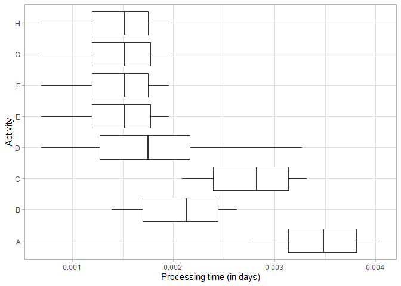

<!-- README.md is generated from README.Rmd. Please edit that file -->

# batchanalytics

<!-- badges: start -->
<!-- badges: end -->

The goal of batch analytics is to provide functions that represent
metrics for analysing batching behaviour. To this end, a web application for interactive analysis with Visualisations is implemented with the shiny library. Furthermore recommendations for an optimal batch behaviour can be given through the package or the webapp.

Web app can be found under batchanalytics/seperate_testing_folder/interactiveBatchAnalytics/


## Installation

You can install the released version of batch analytics from
[CRAN](https://CRAN.R-project.org) with:

``` r
install.packages("batchanalytics")
```

## Example

This is a basic example which shows you how to solve a common problem:

``` r
library(batchanalytics)
library(bupaR)
#> Warning: package 'bupaR' was built under R version 4.0.4
#> 
#> Attaching package: 'bupaR'
#> The following object is masked from 'package:stats':
#> 
#>     filter
#> The following object is masked from 'package:utils':
#> 
#>     timestamp
library(tidyr)
library(lubridate)
#> 
#> Attaching package: 'lubridate'
#> The following objects are masked from 'package:base':
#> 
#>     date, intersect, setdiff, union
## basic example code
```

What is special about using `README.Rmd` instead of just `README.md`?
You can include R chunks like so:

``` r
csv_log = read.csv(system.file("exdata", "sample_data_1.csv", package = "batchanalytics"))

#time converstion - why sometimes read correctly sometimes not?
csv_log$arrival <- as.POSIXct(csv_log$arrival, format = "%Y-%m-%d %H:%M:%S", tz = "GMT") 
csv_log$start <- as.POSIXct(csv_log$start, format = "%Y-%m-%d %H:%M:%S", tz = "GMT") 
csv_log$complete <-  as.POSIXct(csv_log$complete, format = "%Y-%m-%d %H:%M:%S", tz = "GMT")


#creating event_Log
elog <- csv_log %>%
    mutate(activity_instance = 1:nrow(.)) %>%
    gather(status, timestamp, arrival, start, complete)  %>%
    eventlog(
        case_id = "case_id",
        activity_id = "activity",
        activity_instance_id = "instance_id",
        lifecycle_id = "status",
        timestamp = "timestamp",
        resource_id = "resource"
    )
```

You’ll still need to render `README.Rmd` regularly, to keep `README.md`
up-to-date. `devtools::build_readme()` is handy for this. You could also
use GitHub Actions to re-render `README.Rmd` every time you push. An
example workflow can be found here:
<https://github.com/r-lib/actions/tree/master/examples>.

You can also embed plots, for example:

    #> Warning: Removed 401 rows containing non-finite values (stat_boxplot).



In that case, don’t forget to commit and push the resulting figure
files, so they display on GitHub and CRAN.
